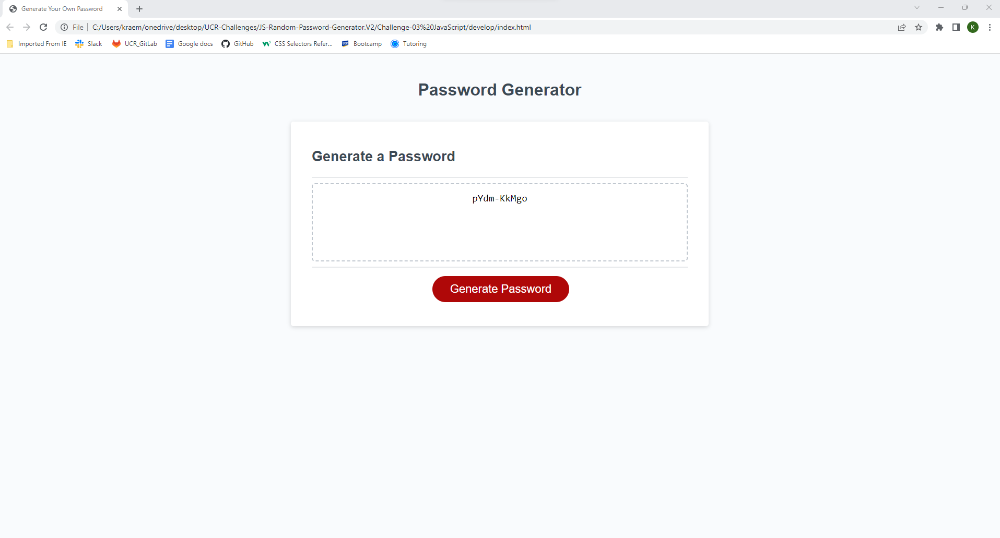

# JS-Random-Password-Generator.V2

## Description
Modification to a starter code that enables employees to generate random passwords based on criteria they've selected; how many characters, special characters, upper case characters, and lower case characters. 

## Live Demo
[Try out my website now](https://kraemz303.github.io/JS-Random-Password-Generator.V2/)

## Screenshot
